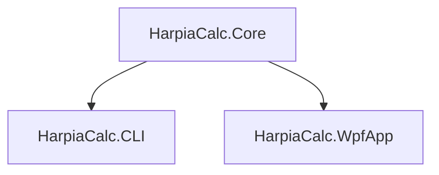

# svd-tests

## Structure

### HarpiaCalc.Core (.NET 8 Class library)
All calculations are done here

**Includes**: all necessary libraries, does not include references to other projects

### HarpiaCalc.CLI (.NET 8 Console application)
Console application for testing and command-line interface

**Includes**: HarpiaCalc.Core

### HarpiaCalc.WpfApp (.NET 8 WPF application)
Application with GUI for more complex function testing, that is not comfortable with CLI

**Includes**: HarpiaCal.Core, additional GUI/plotting libraries